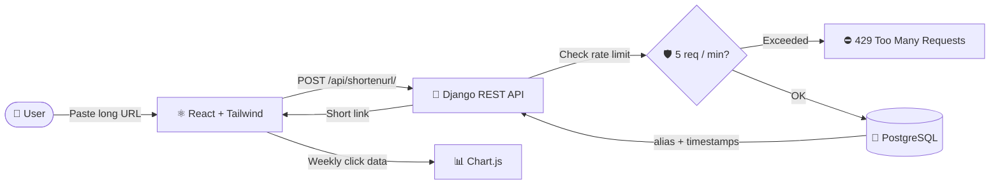
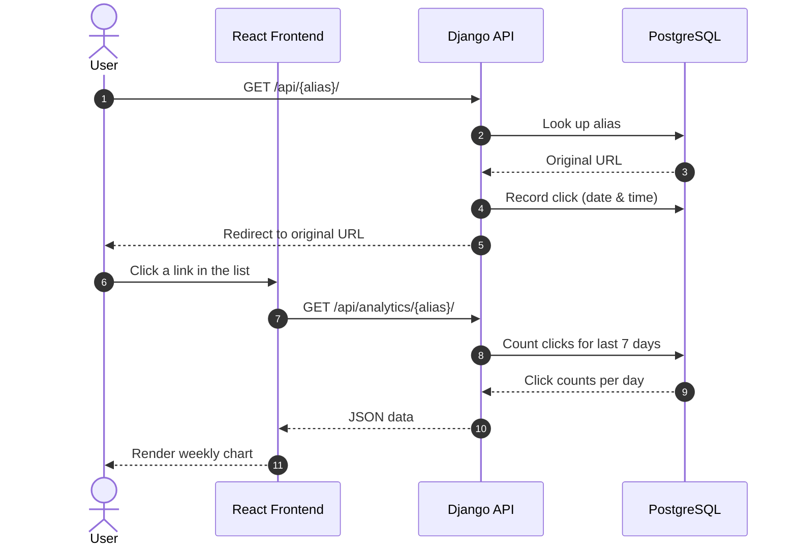
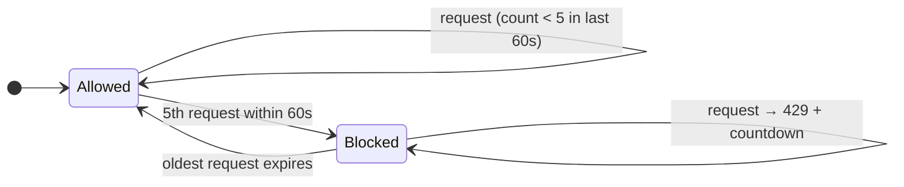

<div align="center">


<a href="https://github.com/prabhatbhusal/Url-Shortener">
  
</a>

<br/>


<br/><br/>


<p>
Url-Shortener is a Full Stack Project Developed By <b>Er. Prabhat Bhusal</b>. This project is developed using React and Tailwind as frontend and Django-Rest Framework and Python as backend and uses PostgreSQL as database to store the link date and time as well as their hash value and how many times the user has clicked the url with hash value to showcase that in a chart within a week with a refresh button.
</p>

<a href="#-how-to-run">How To Run</a> •
<a href="#%EF%B8%8F-how-it-works">How It Works</a> •
<a href="#%EF%B8%8F-rate-limiter-implementation">Rate Limiter</a> •
<a href="#-api-documentation">API Documentation</a>

</div>


## ✨ Features

| | Feature | Description |
|:-:|---|---|
| 🔗 | **URL Shortening** | Turn any `http`/`https` link into a short `localhost/{alias}` link |
| ♻️ | **Duplicate Detection** | Already-shortened URLs are recognised instead of duplicated |
| 📊 | **Click Analytics** | Weekly click chart per link, powered by Chart.js, with a refresh button |
| 🛡️ | **Rate Limiting** | 5 requests per minute per IP, with a live countdown on the frontend |
| 🐳 | **Dockerised** | One command spins up frontend, backend and database |
| ⚙️ | **CI** | GitHub Actions workflow on every push |

<!-- 🎬 Tip: record a short screen capture of the app (e.g. with ScreenToGif or Kap),
     save it as assets/demo.gif, then uncomment the block below. -->
<!--
<div align="center">
  
</div>
-->


## 🏗️ How It Works



### Redirect & analytics flow




## 📁 Project Structure

<details>
<summary><b>Click to expand</b></summary>

```text
URL-SHORTENER/
├── .github/
│   └── workflows/
│       └── ci.yml
├── backend/
│   ├── core/
│   ├── urlshortener/
│   │   ├── __pycache__/
│   │   ├── migrations/
│   │   ├── __init__.py
│   │   ├── admin.py
│   │   ├── apps.py
│   │   ├── models.py
│   │   ├── serializers.py
│   │   ├── tests.py
│   │   ├── urls.py
│   │   └── views.py
│   ├── venv/
│   ├── db.sqlite3
│   ├── Dockerfile
│   ├── manage.py
│   └── requirements.txt
├── frontend/
│   ├── node_modules/
│   ├── public/
│   ├── src/
│   ├── .gitignore
│   ├── Dockerfile
│   ├── eslint.config.js
│   ├── index.html
│   ├── package-lock.json
│   ├── package.json
│   ├── tsconfig.app.json
│   ├── tsconfig.json
│   ├── tsconfig.node.json
│   └── vite.config.ts
├── docker-compose.yml
└── README.md
```

</details>


## 🚀 How To Run

There are two ways to run this project: Docker or locally.

### 🐳 With Docker

1. Clone the Repository

    ```bash
    git clone https://github.com/prabhatbhusal/Url-Shortener.git
    ```

2. Build and Start all the services:

    ```bash
    docker compose up --build
    ```

3. Access the application:
    - Frontend: http://localhost:5173
    - Backend: http://localhost:8000

4. To stop the application

    ```bash
    docker compose down
    ```

### 💻 Without Docker

1. Clone the Repository

    ```bash
    git clone https://github.com/prabhatbhusal/Url-Shortener.git
    cd Url-Shortener
    cd backend
    ```

2. Database - PostgreSQL

    ```bash
    sudo pg_ctlcluster 18 main start
    ```

3. Backend - Django

    ```bash
    source venv/bin/activate
    python manage.py runserver
    ```

4. Frontend - React (open new terminal)

    ```bash
    cd frontend
    npm run dev
    ```


## 🛡️ Rate Limiter Implementation

First of all, I tracked the client request, IP address and time to make sure whether the client is from the same IP address or not. Then the backend records the timestamp of each request and calculates the remaining wait time, so that if the client enters the same or different URLs 5 times within 1 minute, the API returns a `429 Too Many Requests` response. In the frontend, a countdown timer of the remaining wait time is calculated based on the oldest request within the last 60 seconds, and the actual remaining time is shown.




## 📖 API Documentation

| Method | Endpoint | Purpose |
|:-:|---|---|
|  | `/api/shortenurl/` | Create a short link |
|  | `/api/{alias}/` | Redirect to the original URL |
|  | `/api/urls/` | List all shortened URLs |
|  | `/api/analytics/{alias}/` | Weekly click data for a link |

### Endpoints

#### `POST /api/shortenurl/`
- **Request:** The user's URL with `https`/`http`.
- **Response:** Provides a `localhost/{alias}` link. If the link is already in the database it replies that the URL is already shortened; if the input field is empty it replies that the URL is required. It also checks the rate limit, and if the data is new, a link with an alias is created.
- **Status codes:** `HTTP_201_CREATED`, `HTTP_400_BAD_REQUEST`, `HTTP_429_TOO_MANY_REQUESTS`

#### `GET /api/{alias}/`
- **Request:** The user puts the alias in the localhost address, which takes the user to the original URL.
- **Response:** On success, redirects to the original URL. On failure: no URL found.

#### `GET /api/urls/`
- **Request:** No request body, as the data is already stored in the database.
- **Response:** Provides all the URL links when the button is clicked. `HTTP_200_OK`

#### `GET /api/analytics/{alias}/`
- **Request:** Whichever URL the user clicks, the chart asks for that specific alias to look up click count and date.
- **Response:** Provides data to Chart.js, which displays click count and clicked date in a graph.

<div align="center">

<br/>

**Made with ❤️ by Er. Prabhat Bhusal**


</div>
